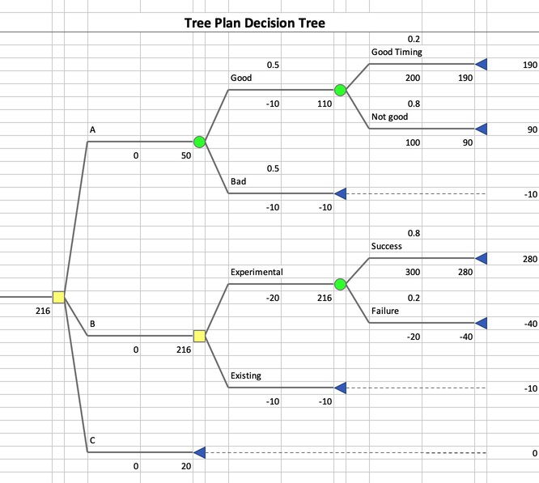

# treeplan
The Excel add-in for tree plan, free and modern version.

## Why this
The widespread treeplan add-in on the web was created in last decade. It is not user friendly and it does not work with Excel for Mac. As the homework for the *"Data, Modeling and Analysis"* course in SJTU Antai MBA, I rewrote this add-in.

It has the following features:

* modern user friendly UI
* three built-in themes
* support for both macOS and Windows
* free forever

## How to install
Install this as a normal Excel add-in:

1. Download the `BYTreePlan.xlam` file

2. (macOS) Open Excel, on the **Tools** menu, select **Excel Add-ins**.

   (Windows) Open Excel, click the **File** tab, click **Options**, and then click the **Add-Ins** category.

3. Click **Browse** to locate the add-in file, and then click **OK**.

## Support
I did this for my homework but I could not guarantee any support. That's the reason I put this on github so anyone can fork and contribute. You can still submit issues here, occasionally I may fix bugs and release new versions.
